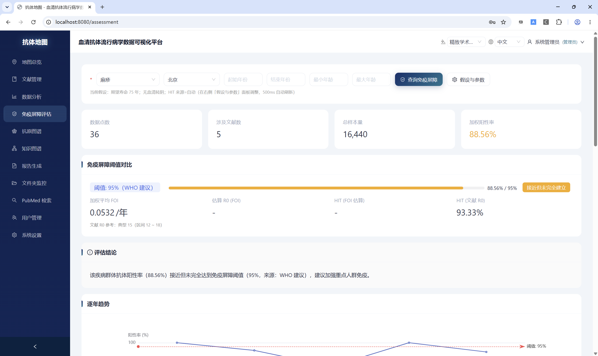
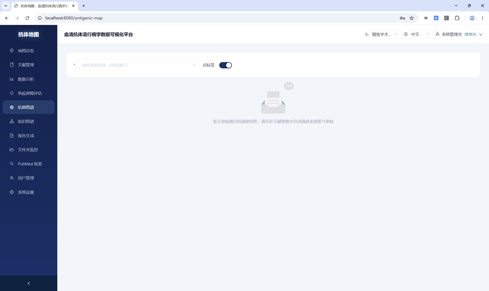
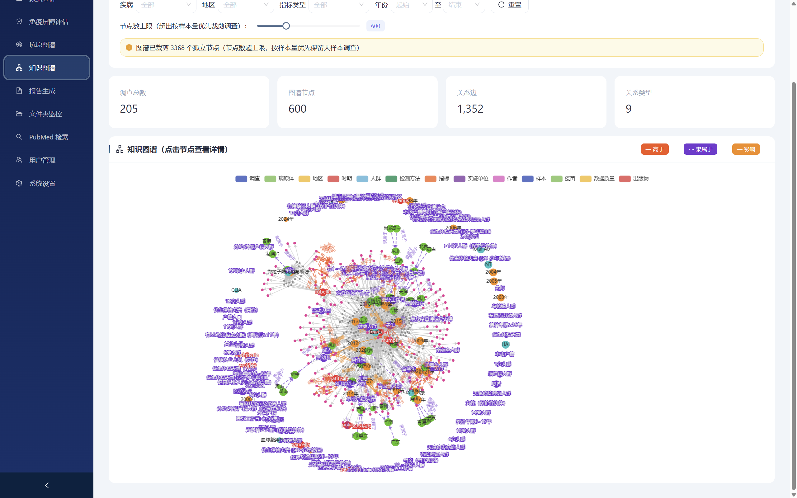
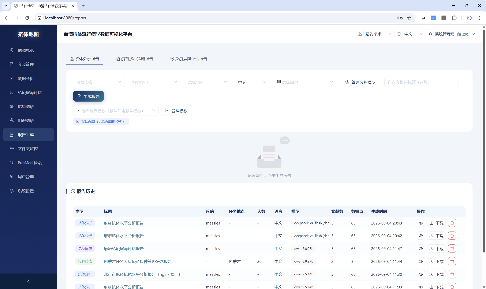
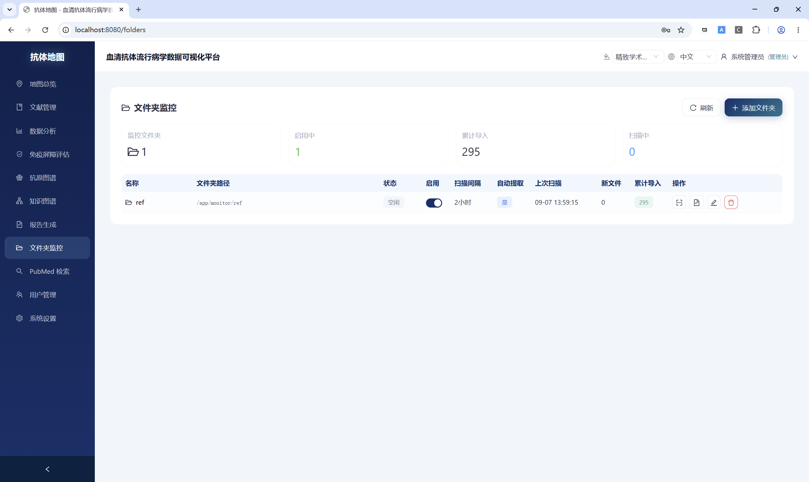
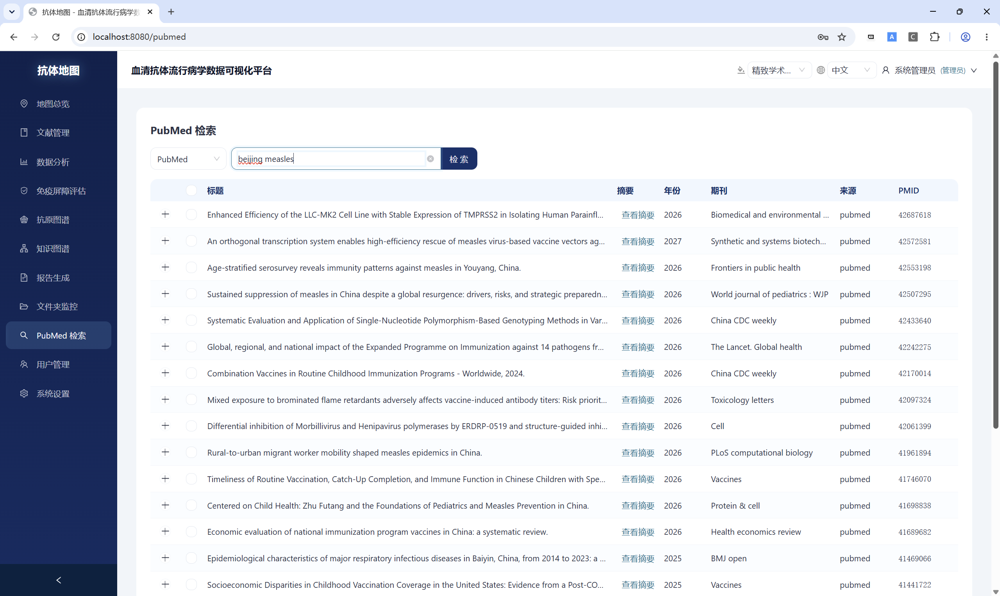
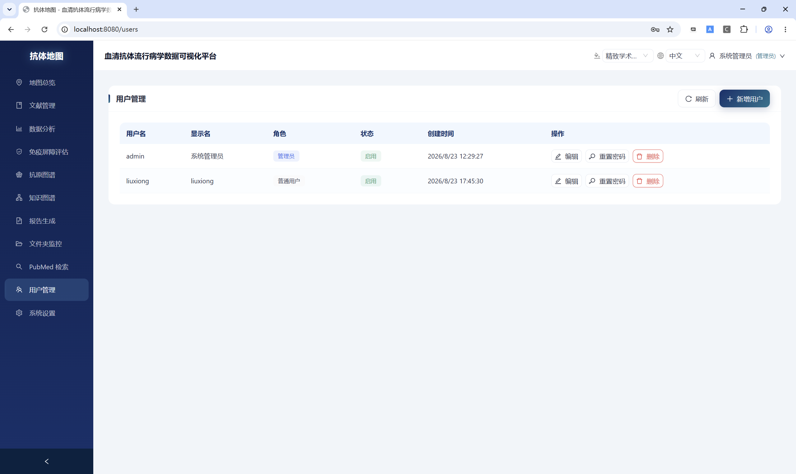
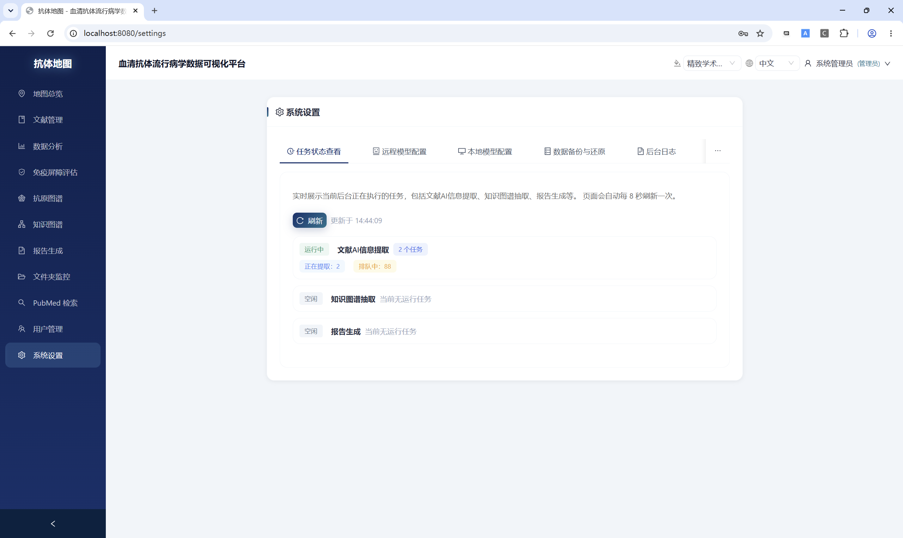

# 核心功能

本文档以**入门教程**的方式介绍 Antibody Map 的核心功能，配合截图让您快速上手。

[](../screenshots/login.png)

1. 打开浏览器访问 `http://localhost:8080`
2. 输入账号和密码（默认管理员账号 `admin`）
3. 点击「登录」进入科研工作台

登录后，左侧菜单依次为：**地图总览 → 文献管理 → 数据分析 → 流行特征 → 免疫屏障评估 → 抗原图谱 → 知识图谱 → 报告生成 → AI 提取自测 → 文件夹监控 → PubMed 检索 → 用户管理 → 系统设置**。

### 功能速览

按五大模块归类，括号内为本文档对应章节：

- **文献与数据导入**（§2 文献管理）
  - PDF/CAJ/DOCX/EPUB/PPTX/XLSX/TXT/HTML 上传，URL 导入，RIS/EndNote/PubMed/WoS 题录批量导入
  - 从 TXT/CSV 导入匹配（UUID 精确 / 标题-作者模糊），批量打 Tag 编组
  - PDF 在线预览，重复检测与合并，回收站
  - MinerU（GPU 加速）+ AnyDoc（Rust）+ pdf-inspector 损坏修复，自动回退

- **AI 自动提取**（§2.3 AI 数据提取 + §9 AI 提取自测）
  - LLM 自动提取血清阳性率/GMC 等数据点，支持 DeepSeek/OpenAI/Qwen/本地 Ollama
  - 长文档分块并行，精确字符级溯源，强 Schema 校验
  - 历次提取历史可追溯（模型/耗时/Token/费用）
  - **追加模式安全**：强制 append 禁用 replace；**enable_thinking** 开关贯通 API→Ollama extra_body
  - 合成自测：批量产出含已知答案的合成文献，多模型串行跑真实提取链路，产出召回率/精确率 CSV

- **人工审核修订**（§2.4 数据审核）
  - 通过/驳回，行内编辑，批量操作
  - 「LLM 原始 vs 人工修改」diff 留痕
  - 管理员一键扫描 extraction_history vs data_point 实际行数，自动修正 `[DP_DROPPED]`

- **地图可视化与多维分析**（§1 地图总览 + §3 数据分析 + §4 流行特征 + §5 免疫屏障评估 + §6 抗原图谱 + §7 知识图谱）
  - 全国/省/市/区县四级交互式抗体热力地图，时间序列动画，热点分析
  - 逐年趋势、区域对比、分区对比、年龄分层、FOI 感染力、VE 疫苗效果
  - Meta 分析（森林图/漏斗图）、空间热点/冷点（Moran's I + Getis-Ord Gi*）
  - **免疫屏障 R_eff NGM 残差法**（新世代矩阵，真正 R_eff < 1 判据）+ 多情景批量模拟 × VE 疫苗效率 + 出生队列加权投影
  - 参考常量 JSON 化：WHO HIT / R0 / NIP 覆盖（15 病种 × citation，透明可审计）
  - 多域扩展：单一 data_point Schema 覆盖 immunology / epidemiology / pathogen
  - HI/VNT/ELISA 滴度矩阵 metric MDS 降维抗原图谱
  - 13 实体 + 18 关系多维语义知识图谱，计算式推导 + LLM 抽取，智能咨询问答

- **报告生成与导出**（§8 报告生成）
  - 抗体分析 / 疫苗接种策略 / 免疫屏障评估三类报告
  - 后台异步生成，在线编辑，支持 Markdown / Word / PDF 下载

- **系统运维**（§10 文件夹监控 + §11 PubMed 检索 + §12 用户管理 + §13 系统设置）
  - pg_dump 逻辑备份 + 每 60 分钟自动备份（保留 48 份）+ PostgreSQL WAL 加固
  - 文件夹监控自动扫入新文献、PubMed 检索批量导入
  - 管理员 / 操作员 / 只读三档权限划分

下面按左侧菜单顺序逐一介绍。

---

## 1. 地图总览

[](../screenshots/map.png)

地图总览是系统默认首页，以**热力地图**直观展示全国 / 省级 / 市级 / 区县级抗体水平分布，支持省→市→区三级下钻。

### 1.1 使用步骤

1. 在左侧选择「地图总览」
2. 选择疾病类型（如麻疹、风疹、百日咳等）与指标（血清阳性率、GMC 等）
3. 设置年份范围、年龄段等筛选条件
4. 点击「查询」刷新地图，点击「重置」清空筛选

### 1.2 交互操作

- **三级下钻**：点击省份下钻到该省**市级**数据；继续点击某市可下钻到**区县级**数据（直辖市直接下钻到区级）。点击空白区域或地图左上角「返回全国」退出下钻
- **时间滑块**：切换「静态总览 / 时间序列」，拖动查看不同年份的变化动画
- **热点分析**：切换「阳性率 / 热点分析」视图，查看空间热点分布
- **省份列表排序与筛选**：地图旁省份列表可按**阳性率 / GMC / 数据点数量**排序，并可关键字筛选省份，快速定位目标地区
- **图例说明**：颜色深浅表示阳性率高低
- 底部统计区展示总数据点数、覆盖省份数、总样本量等总量指标

---

## 2. 文献管理

文献管理是系统的基础模块，所有数据提取和分析都依赖文献库。

[](../screenshots/literature.png)

### 2.1 导入文献

| 方式 | 操作步骤 |
|---|---|
| **上传文件** | 点击「上传文献」→ 选择 PDF/CAJ/EPUB/DOCX/PPTX/XLSX/TXT 文件 → 自动识别标题并入库 |
| **从本地文件夹导入** | 点击「从本地文件夹导入」→ 选择本机一个文件夹 → 批量扫描并导入其中的文献文件 |
| **URL 导入** | 点击「从 URL 导入」→ 输入网页链接 → 抓取 HTML 内容创建文献 |
| **题录批量导入** | 点击「导入文献」→ 选择 RIS / EndNote / PubMed 文本 / WoS 格式文件 → 自动查重后导入 |
| **PubMed 检索** | 见「[10. PubMed 检索](#10-pubmed-检索)」 |
| **文件夹监控** | 见「[9. 文件夹监控](#9-文件夹监控)」 |

### 2.2 文献列表操作

- **筛选**：按提取状态、审核状态、疾病、省份、期刊、创建时间等进行过滤
- **排序**：点击表头按标题、作者、创建时间等列排序
- **搜索**：关键词模糊搜索标题 / 作者 / 期刊 / 摘要 / 关键词
- **批量操作**：多选后批量 AI 提取、批量删除、批量导出
- **文档预览**：点击展开在线预览 PDF/DOCX 等格式（本地 cmaps 支持中文显示，PDF 文本层支持鼠标框选、复制内容）
- **元数据同步**：批量同步标题、作者、期刊等元信息

### 2.3 AI 数据提取

系统通过 LLM 自动从文献中提取血清阳性率、GMC 等数据点。勾选文献后点击「AI 提取」即可提交后台 Celery 任务。

#### 提取流程

1. **入队**：任务进入队列，状态 `queued`；实际开始提取时变为 `processing`
2. **取输入**：有关联文件则解析全文；无文件但有摘要则直接用摘要
3. **解析文本与表格**：AnyDoc 优先，失败自动回退 OCR / MinerU 等；PDF/CAJ 提取结构化表格并转 Markdown 注入提示词
4. **LLM 调用 + 缓存**：先按「文献 + 模型 + 趟数 + 阈值 + 文本指纹」查 Redis 缓存，命中则跳过调用直接重建数据点；未命中则多趟并发调用 LLM
5. **校验与置信度**：字符级溯源、强 Schema / 省份枚举 / 值域校验，按问题数量自动降级置信度（越低越靠前进入人工审核）
6. **落地**：清除旧数据点 → 归并子估计 → 补全文献元信息 → 状态置 `done` / `done_no_data` → 写入提取历史与缓存

#### 状态含义（MECE）

| 状态 | 含义 | 是否可继续 |
|---|---|---|
| **待处理** `pending` | 文献已入库但尚未提交提取 | 进行中 |
| **排队中** `queued` | 已提交，正在队列中等待空闲 worker | 进行中 |
| **提取中** `processing` | worker 正在实际提取（受并发上限约束） | 进行中 |
| **已完成** `done` | 提取成功，有数据点 | 终局 ① |
| **已完成无数据** `done_no_data` | 提取成功但文中无有效数据（综述/无数值） | 终局 ② |
| **失败** `failed` | 提取出错中断，可重新提交 | 终局 ③ |

三个终局（已完成 / 已完成无数据 / 失败）互斥，一篇文献最终只落在其中一种。点击「提取状态」按钮可查看各状态实时数量，与列表筛选器、行内状态徽章口径一致。

#### 历次 AI 提取历史

文献详情页摘要下方直接内联展示「历次 AI 提取历史」表格（无需点击弹窗，进入详情页即自动加载）。每次提交 / 重新提取都会追加一条记录。表格列已扩展至 20+ 列，所有列标题悬停均有 Tooltip 解释：

| 列 | 说明 |
|---|---|
| **时间** | 提取完成时间（MM-DD HH:mm） |
| **模型** | 使用的大模型（`ollama:` 前缀=本地部署） |
| **状态** | success / no_data / failed |
| **点数** | 落库的数据点总数 |
| **Token** | 总 Token（悬停看 Prompt / Completion 分解） |
| **In / Out** | 输入 / 输出 Token 分项 |
| **VRAM** | GPU 显存峰值（GB，悬停看 ctx / max_out） |
| **GPU→CPU** | ✓绿=全 GPU 驻留 / ⚠橙=有泄露到 CPU |
| **ctx / out** | Ollama 上下文窗口 / 最大输出 token 上限 |
| **tps** | 生成速度（token/s） |
| **调用** | LLM 调用次数 |
| **耗时** | 全流程（PDF 解析+prompt+decode+后处理） |
| **Decode** | GPU 纯生成耗时（`eval_duration`） |
| **TTFT** | 首 token 延迟（prefill 速度） |
| **费用** | API 费用（本地 Ollama 通常为 0） |
| **错误** | 错误分类 Tag（悬停看完整错误信息） |
| **操作** | 重新提取（沿用该记录所用的模型） |

表格使用 `scroll={{ x: 'max-content' }}` 自适应宽度——窗口够宽时无横向滚动条，窄时自动出现。

**📥 导出历史指标 CSV**：表格右上角有导出按钮，按当前文献的全部历史导出 17 列指标（含 VRAM_MB/GB、tokens_per_sec、avg_first_token_ms、duration_seconds、llm_cost_usd 等）。全局批量导出走 `GET /api/v1/extraction/export-history` 端点，支持按模型（LIKE 模糊匹配）、状态、日期、文献过滤，返回完整 CSV，供多模型横向对比分析。

状态变更时的历史轨迹也保证完整：卡死自动重置（超 30 分钟回收）与手动「终止 / 重置我的提取」都会写入对应的 `failed` 历史记录。

#### 并发与排队

- 文献级并发：worker 最多同时 **2 篇**处于 `processing`
- 分块级并发：单篇文本超 10,000 字符时分块，块内 2 个并发调 LLM（需与 `LLM_CONCURRENCY` 一致）
- `queued` 和 `processing` 状态的文献不会重复提交

#### 终止与重置

点击「终止所有提取」可：强制终止运行中任务 → 清空队列 → 将 `processing/queued` 状态重置为 `failed`。超过 30 分钟无进度的任务会被自动重置为 `failed`（防卡死）。

#### 远程模型 API Key 安全通道

- API Key 有两种来源：
  - **系统级**：在 .env 里配 API_KEY_DEEPSEEK / API_KEY_OPENAI 等环境变量（启动时读取）
  - **数据库级**：在「系统设置 → 模型配置」中添加远程模型时录入，使用 Fernet（HKDF-SHA256 v2）加密后存入 pi_model_config 表
- 数据库级 Key 的安全性：Celery 队列**只传递 model_config_id**，worker 运行时从 DB 取出密文再解密，**明文永不落 Redis**；解密失败（InvalidToken）回退为「缺 Key」安全路径，不会把密文返回给前端

#### Prompt 三类数据全覆盖 + 动态文本类型引导

AI 提取系统 Prompt 已升级为**同时提取血清学 + 流行病学监测 + 病原学三类数据**，覆盖 incidence_rate / case_count / mortality_rate / death_count 等流行病学字段。

**动态文本类型引导**（`orchestrator.py` 的 `_detect_text_profile()`）在每次提取前检测文献前 8000 字符中的关键词密度：

| 检测结果 | 注入的引导段 | 效果 |
|---|---|---|
| 纯流行病学（血清学信号=0，流行病学≥2） | 血清学字段全 null，强制输出 incidence/case/mortality | 杜绝模型幻觉 IgM/ELISA/阳性率；防止因"麻疹应有血清数据"先验而返回空 data_points |
| 混合型（两类信号都有） | 两类数据都要提取，可共存于同一 data_point | 避免模型只关注血清学而忽略真实存在的流行病学数据 |
| 纯血清学 | 无额外引导 | 正常提取血清学数据 |

**三类指标判别规则**（写入 Prompt 让模型理解分母差异）：
- `positivity_rate` 分母是**血清样本量**（"多少比例的血清样本检测呈抗体阳性"）
- `incidence_rate` 分母是**人口数**（"一定时间内某人群发病频率"，单位通常 /10万、‰）
- `case_count` 是**整数病例总数**（"X例"）

**source_context 硬约束**：每条 ≤25 字关键数字短语（✅"阳性率84.3%" / ❌"2019年北京市报告麻疹病例236例"）

**Token 预算硬约束**：completion ≤ 6000，source_context 合计 ≤ 300 tokens，超预算时先砍 source_context 再砍方法学描述。

#### 文献详情页的浏览与数据

- **上一篇 / 下一篇**：详情页标题栏右侧新增「上一篇（←）」「下一篇（→）」按钮，与文献列表保持相同排序，首位/末位自动置灰；两个按钮共用一次列表请求，不重复调 API
- **数据点分页**：详情页数据点表格支持分页（默认 50 条/页，可切 20/50/100），跨页批量审核时自动保留选中行
- **文件导出**：文献详情页的「导出 Excel/CSV/JSON」、地图总览的「导出当前视图」已修复鉴权——改用统一的 blob 下载 service 携带 JWT，不再因 401 静默失败

### 2.4 数据审核

1. 每个数据点可**通过**或**驳回**；驳回时填写审核意见，批量驳回强制填写
2. 审核人和审核时间自动记录
3. 支持**行内编辑**：直接修改疾病、地区、年龄段、数值等字段
4. 也可手动新增数据点

### 2.5 重复检测与合并

点击「扫描重复」，系统自动按 DOI/标题/作者/PDF 哈希检测重复，结果以分组列表展示，可逐组合并或一键合并全部。

### 2.6 回收站

删除的文献移入回收站（软删除），30 天内可还原。点击「回收站」查看已删除文献，支持还原、永久删除和清空回收站。

---

## 3. 数据分析

数据分析模块用于从不同维度「解剖」血清抗体数据，回答科研和公卫中的实际问题。每个分析都从已审核的数据点出发，确保结果可靠。

[](../screenshots/analysis.png)

### 3.1 通用操作流程

1. 在左侧选择「数据分析」
2. 在顶部筛选面板中设置疾病、省份、年份范围、年龄范围等条件
3. 在下方选择具体分析类型（选项卡切换）
4. 点击「查询」生成图表
5. 点击「导出 CSV」保存数据，或点击「导出 Excel」打包全部分析结果

> 所有分析基于**已审核通过**的血清阳性率（seroprevalence）主估计数据点（不含子估计，除非特别说明）。

---

### 3.2 逐年趋势分析

**这是什么？**
把多年的数据按年份画出一条曲线，看抗体阳性率（或 GMC）是**上升、下降还是平稳**。类似于看股票 K 线图——但不是看股价，而是看人群免疫水平的变化趋势。

**需要什么数据？**
- 已审核的血清阳性率或 GMC 数据点，需有**年份**（collection_year）和**样本量**
- 北京 2018 年 → 阳性率 85%（样本量 500）
- 北京 2019 年 → 阳性率 88%（样本量 600）
- 北京 2020 年 → 阳性率 92%（样本量 550）

**怎么做？**
1. 同一年份内的多篇文献数据先做 **Meta 合并**（Freeman-Tukey 双反正弦变换随机/固定效应模型），得到该年综合阳性率 + 95% CI
2. 把各年份的合并结果按时间顺序连成曲线
3. 对逐年数据做**加权线性回归**（权重 = 各年总样本量），检验趋势是否有统计学意义
4. 额外做 **Cochran-Armitage 趋势检验**（当有 ≥3 个年份时）

**公式（看懂即可，不用记）：**
- 加权线性回归：`y = a + b·x`，其中 x = 年份，y = 阳性率，b = 斜率（正=上升，负=下降）
- 趋势显著性用 **t 检验** 判断斜率 b 是否显著不等于 0
- Cochran-Armitage 检验：把各年份的阳性人数和总人数组织成列联表，计算 Z 统计量

**结果怎么看？**
- 曲线上每个点代表该年综合阳性率，带误差棒（95% CI）
- 斜率 > 0 且 p < 0.05 → 阳性率显著上升；斜率 < 0 且 p < 0.05 → 显著下降
- 斜率接近 0 或 p ≥ 0.05 → 没有明显趋势

**有什么价值？**
- 评估疫苗接种计划实施后，人群免疫水平是否逐年提升
- 发现某一年突然下降 → 可能提示疫苗覆盖率不足或疫情风险增加
- 为制定后续免疫策略提供数据支撑

---

### 3.3 区域对比分析

**这是什么？**
把不同省份的数据并排比较，看哪些省份抗体水平高，哪些低。类似于期末考试后看各科平均分排名。

**需要什么数据？**
- 已审核的血清阳性率或 GMC 数据点，需有**省份**和**样本量**
- 广东 → 阳性率 75%（样本量 800）
- 北京 → 阳性率 88%（样本量 600）
- 云南 → 阳性率 92%（样本量 1400）

**怎么做？**
1. 同一省份的多篇文献做 **Meta 合并**，得到该省综合阳性率
2. 额外做**年龄标化**（ASR，直接法，以第七次全国人口普查为标准人口），消除省份间年龄结构差异的影响
3. 当恰好比较两个省份时，做**两样本率检验**，输出率差（RD）和率比（RR）及 95% CI

**公式：**
- 年龄标化（直接法）：`ASR = Σ(w_k × p_k) / Σw_k`，其中 w_k = 标准人口中 k 年龄组权重，p_k = 该年龄组阳性率
- 两样本率检验：`Z = (p₁ - p₂) / √(p̄(1-p̄)(1/n₁ + 1/n₂))`

**结果怎么看？**
- 柱状图横轴为省份，纵轴为阳性率，带误差棒
- 可切换「粗率 / 标化率」视图——标化率消除了年龄结构差异，更公平
- 证据不足（样本量太小或研究太少）的省份会标记提示

**有什么价值？**
- 发现高发省份（低抗体水平）→ 重点加强免疫
- 省份间对比可评估免疫规划实施的均衡性
- 标化率排除了「该省老年人多所以阳性率低」这类干扰

---

### 3.4 年龄分层分析

**这是什么？**
按年龄段分组，看不同年龄的人抗体水平有什么差异。比如小孩的抗体水平是否比成年人高，老年人是否抗体下降。

**需要什么数据？**
- 已审核的数据点，需有**年龄范围**（age_min, age_max）和**样本量**
- 系统自动将数据点归入标准年龄组：0-4 岁、5-14 岁、15-29 岁、30-44 岁、45-59 岁、≥60 岁

**怎么做？**
1. 对每个数据点，根据 age_min 和 age_max 推算归属的年龄组
2. 同一年龄组内的多篇文献做 Meta 合并，得到该年龄组综合阳性率
3. 输出每个年龄组的阳性率 + 95% CI + 样本量 + 数据点数

**结果怎么看？**
- 柱状图或折线图横轴为年龄组，纵轴为阳性率
- 如果阳性率随年龄上升 → 可能是自然感染积累（如麻疹在成年人中更高）
- 如果阳性率在儿童中很高 → 说明疫苗接种计划执行得好但可能自然感染也在发生

**有什么价值？**
- 识别「免疫洼地」年龄段（阳性率显著低于其他年龄组）
- 为制定针对性免疫策略（如某年龄段的补充接种）提供依据
- 结合出生队列可判断代际免疫差异

---

### 3.5 数据覆盖度分析

**这是什么？**
评估当前数据在地理维度和时间维度上的覆盖情况——哪些省有数据、哪些省缺数据、哪些年份数据充足。类似于检查你收集的数据有没有「空白区」。

**需要什么数据？**
- 所有已审核的数据点，含省份、年份、样本量

**怎么做？**
1. 按省 × 年建立覆盖矩阵（行 = 省份，列 = 年份）
2. 每个格子根据数据量和样本量评估覆盖状态：「完善」「需审核」「需补充」或「需审核+补充」
3. 计算完整性评分（覆盖了多少省份 × 年份组合）

**结果怎么看？**
- 热力图矩阵：绿色 = 覆盖完善，黄色 = 需要补充，红色 = 缺数据
- 完整性评分 = 已覆盖格子数 / 总格子数 × 100%

**有什么价值？**
- 一眼看出哪些地方是「数据荒漠」——后续文献检索时可以优先补充
- 避免在数据严重缺失的省份/年份下结论（结果可能不可靠）

---

### 3.6 FOI 感染力分析 & 群体免疫屏障评估

**这是什么？**
这是综合分析模块的**核心**。它回答两个问题：
1. **感染力（FOI）**：人群每年被感染的风险有多大？（类似于「每年有多少易感者被感染」）
2. **群体免疫阈值（HIT）**：要有多少人免疫才能阻断传播？我们达到了吗？

**需要什么数据？**
- 已审核的血清阳性率数据点，需有**年龄**（可推算年龄中点）和**样本量**
- 本质上是「年龄 × 阳性率」的横截面数据

**怎么做？**

**Step 1：按年龄组计算 FOI**
- 对每个年龄组，用公式：`λ = -ln(1 - SP) / age`
- λ = 感染力（FOI），SP = 血清阳性率（0-1），age = 年龄组中点
- 举例：10 岁儿童阳性率 80%，则 λ = -ln(1-0.8)/10 = -ln(0.2)/10 = 1.609/10 = 0.161/年，意味着每年约 16% 的易感者被感染

**Step 2：催化模型拟合（MLE 方法）**
- 系统用 3 种模型拟合年龄-阳性率曲线，自动选出最优模型：
  - **M1（简单模型）**：恒定 FOI，假设各年龄感染风险相同
  - **M2（两阶段模型）**：低龄 FOI 和高龄 FOI 不同
  - **M3（衰减模型）**：FOI 随年龄衰减
- 输出推荐模型 + 拟合曲线 + 模型比较

**Step 3：反推 R0 和 HIT**
- 如果选 M1 模型且疾病为地方性、终生免疫（如麻疹）：`R₀ ≈ λ × L`（L = 期望寿命，默认 75 年）
- `HIT = (1 - 1/R₀) × 100%`
- 举例：λ = 0.161/年 → R₀ = 0.161 × 75 = 12.1 → HIT = (1 - 1/12.1) × 100% = 91.7%
- 也参考文献 R0 值和 WHO 阈值，三者取最优

**Step 4：群体免疫状态判定**
- 实际阳性率 vs HIT 阈值：
  - 实际 ≥ HIT → **「已达群体免疫」**
  - 实际 ≥ HIT - 10% → **「接近」**
  - 实际 < HIT - 10% → **「未达到」**

**结果怎么看？**
- 年龄组 FOI 柱状图：柱子越高，该年龄段感染压力越大
- 统计卡片展示：加权 FOI、R₀、HIT、WHO 阈值
- 省级 FOI 矩阵：每个省份的 FOI 水平和达标状态
- 群体免疫状态标签：绿色「已达」、黄色「接近」、红色「未达到」

**有什么价值？**
- 判断是否需要加强免疫（如未达到群体免疫阈值）
- 估算 R₀ 用于疫情建模
- 发现哪些年龄段 FOI 高（感染风险大）→ 优先保护
- 省对比：哪些省份免疫屏障薄弱

---

### 3.7 疫苗效果（VE）分析

**这是什么？**
比较**已接种**和**未接种**人群的血清阳性率，估算疫苗保护效果。类似于「打了疫苗的人得病的概率比没打的人低多少？」

**需要什么数据？**
- 已审核的血清阳性率数据点，且需通过**子估计**（subgroup）明确标注了「接种状态」：已接种组 vs 未接种组
- 如：同一篇文献中，已接种疫苗的儿童阳性率 90%，未接种的儿童阳性率 65%

**怎么做？**
1. 将数据点按接种状态拆分为已接种组（vaxxed）和未接种组（unvaxxed）
2. 分别计算两组加权平均阳性率（SP_v 和 SP_u）
3. 计算 VE：`VE = 1 - (1 - SP_v) / (1 - SP_u)`
   - 分母 = 未接种组的易感比例（1 - SP_u），即未接种者中可能被感染的比例
   - 分子 = 已接种组的易感比例（1 - SP_v），即接种后仍可能被感染的比例
   - VE 越高，说明疫苗保护效果越好

**公式：**
```
VE = 1 - (1 - SP_v) / (1 - SP_u)
```
- SP_v = 已接种组阳性率，SP_u = 未接种组阳性率
- 如果 SP_v ≥ SP_u，说明接种组和未接种组差不多或接种组更高，**无法用该公式计算 VE**（属于疫苗诱导抗体而非保护性维度）

**结果怎么看？**
- VE ≈ 85% → 接种疫苗后，感染风险降低了约 85%
- VE = 0% → 疫苗没有保护效果
- VE < 0 → 反常情况（需检查数据，可能接种组接触风险更高）

**有什么价值？**
- 评估疫苗在真实世界中的保护效果
- 不同省份的 VE 对比 → 是否存在疫苗效果差异
- VE 随时间变化 → 判断是否需要加强针

---

### 3.8 接种率双轨分析

**这是什么？**
从两个维度看接种率：
1. **NIP 参考接种率**：国家免疫规划的官方报告接种率（来自文献/官方数据）
2. **血清阳性率反推隐含接种率**：从实际测得的抗体水平反算「要达到这个阳性率，需要多少人接种过」

**需要什么数据？**
- 已审核的血清阳性率 + 同疾病的 FOI/HIT 分析结果
- 系统内置了 NIP 参考接种率表（各省份、各疫苗）

**怎么做？**
1. 计算实际血清阳性率（SP）
2. 从 FOI 分析中得到 HIT 阈值
3. 反推隐含接种率：`implied_cov = (SP - 0.5 × HIT) / (1 - 0.5 × HIT)`（一个近似公式，假设一半的未接种者因自然感染也产生了抗体）
4. 对比 NIP 参考接种率，判断达标情况

**结果怎么看？**
- 隐含接种率 ≥ NIP 参考 → **on_track（达标）**
- 隐含接种率 ≥ NIP 参考 - 10% → **near（接近）**
- 隐含接种率 < NIP 参考 - 10% → **below（未达标）**

**有什么价值？**
- 评估官方报告的接种率是否可信（血清学数据是客观的「金标准」）
- 发现「报告接种率很高但实际阳性率很低」的矛盾 → 提示需要调查原因

---

### 3.9 省间公平性分析

**这是什么？**
评估各省之间抗体水平的**差异程度**——好的免疫规划应该是各省差距不大。越公平，说明免疫服务覆盖越均衡。

**需要什么数据？**
- 已审核的血清阳性率数据点，覆盖多个省份，有样本量

**怎么做？**
1. 对每个省份计算加权阳性率（或年龄标化率 ASR）
2. 计算 **基尼系数（Gini）**：0 = 完全均等，1 = 完全不均等（类似收入分配公平性指标）
3. 计算 **变异系数（CV）**：标准差 / 均值，衡量相对离散程度
4. 对照 WHO 免疫屏障阈值，统计达标省份比例
5. 排名：Top 5 最佳省份和 Bottom 5 最差省份

**公式：**
- 基尼系数：`G = 2·Σ(i+1)·x_i / (n·Σx_i) - (n+1)/n`（x_i 为排序后的阳性率，i 从 0 起）
- 变异系数：`CV = 标准差 / 均值`

**结果怎么看？**
- 基尼系数 < 0.15 → 省间差异很小，接种公平性好
- 基尼系数 > 0.25 → 差异较大，需要关注免疫薄弱省份
- 达标比例 = 已达标省份数 / 总省份数，越高越好

**有什么价值？**
- 评估免疫规划的区域均衡性
- 发现「掉队」的省份，作为重点干预对象
- 为卫生资源分配提供数据支撑

---

### 3.10 空间热点分析

**这是什么？**
不仅看每个省的阳性率，还看**空间上是否聚集**——高阳性率省份是否挨在一起（热点），低阳性率省份是否扎堆（冷点）。

**需要什么数据？**
- 已审核的血清阳性率，覆盖至少 8 个省份
- 系统内置了省份邻接关系图（binary queen 邻接矩阵）

**怎么做？**
1. 先复用区域对比的结果，得到每个省的加权阳性率
2. 构建空间权重矩阵（省份相邻 = 1，不相邻 = 0，然后行标准化）
3. 计算 **Moran's I**（全局空间自相关指数）：
   - I > 0 → 正空间自相关（高-高聚集或低-低聚集）
   - I < 0 → 负空间自相关（高-低交错）
   - I ≈ 0 → 随机分布
4. 计算 **Getis-Ord Gi\***（局部热点指标）：
   - 对每个省，计算 Gi\* Z 值
   - Z > 1.96 → 热点（高阳性率省份聚集）
   - Z < -1.96 → 冷点（低阳性率省份聚集）
   - 中间值 → 不显著
5. 使用 **Benjamini-Hochberg FDR 校正** 控制多重比较假阳性

**结果怎么看？**
- 地图上标记出热点区域（红色）和冷点区域（蓝色）
- 全局 Moran's I 告诉你是否存在空间聚集趋势
- 各省的 Gi\* 值和 cluster 标签（Hot/Not Significant/Cold）

**有什么价值？**
- 发现「传染病传播走廊」——热点区域可能意味着传播链活跃
- 冷点区域可能意味着免疫水平高，可以探究其成功经验
- 为跨省联防联控提供依据

---

### 3.11 Meta 分析

**这是什么？**
把多个研究的结果「加权平均」成一个综合估计，同时评估不同研究之间的差异程度（异质性）。类似于你找了 10 篇文献都报告了北京麻疹阳性率，要把它们科学地合并成一个数。

**需要什么数据？**
- 已审核的血清阳性率主估计，默认仅纳入质量评级 A+B 级的数据点
- 可指定分组变量（province / year / age_group）进行亚组分析

**怎么做？**
1. 对每篇文献，提取阳性率 p、样本量 n、置信区间 ci_lower/ci_upper
2. 用 **Freeman-Tukey 双反正弦变换** 对率做变换，稳定方差
3. 做**随机效应 Meta 合并**（DerSimonian-Laird 法），输出合并率 + 95% CI
4. 计算异质性指标：
   - **I²**：异质性百分比（0-100%）
   - **Q 统计量**：Cochran 异质性检验
   - **τ²**：研究间方差
5. 若指定了分组变量，额外做**亚组异质性 Q_between 检验**，判断组间差异是否显著

**公式：**
- Freeman-Tukey 变换：`t = arcsin(√(x/(n+1))) + arcsin(√((x+1)/(n+1)))`，其中 x = 阳性数
- 合并后还原：`p_pooled = (sin(t_pooled/2))²`
- I² = max(0, (Q - df)/Q) × 100%
  - I² < 25% → 低异质性（研究间结果一致）
  - I² 25%-50% → 中度异质性
  - I² > 50% → 高度异质性（研究间差异大，需谨慎解读）

**结果怎么看？**
- 森林图：每行 = 一项研究，带方块（点估计）和横线（95% CI），底部菱形 = 合并结果
- 漏斗图：检查是否存在发表偏倚（不对称 → 可能有偏倚）
- I² 高 → 合并结果可能不可靠，需要做亚组分析找原因

**有什么价值？**
- 综合多篇文献，得到更可靠的疾病负担估计
- 发现不同地区/年份/年龄组的阳性率差异
- 指出哪些研究是「异常值」，需要进一步核对

---

### 3.12 出生队列分析

**这是什么？**
按出生年份分组，看不同世代的人免疫水平有何差异。比如 1990 年代出生的人抗体水平是否比 2000 年代出生的人低。

**需要什么数据？**
- 已审核的血清阳性率，需有**年龄**和**调查年份**（collection_year）
- 系统自动计算出生年份：`birth_year = collection_year - age_mid`

**怎么做？**
1. 对每个数据点，推算出生年份（birth_year）和年龄中点（age_mid）
2. 按出生十年段（如 1990-1999、2000-2009）和调查年份交叉分组
3. 每个格子计算加权阳性率 + 95% CI
4. 输出热力图矩阵（行 = 出生十年段，列 = 调查年份）

**结果怎么看？**
- 热力图：颜色越深，阳性率越高
- 对角线方向看：同一出生队列随年龄增长的变化
- 垂直方向看：同一年份不同出生队列的差异

**有什么价值？**
- 揭示「代际免疫」现象——老一辈通过自然感染获得免疫力，年轻一代靠疫苗
- 计划免疫实施前后出生的队列对比 → 评估疫苗引入效果
- 发现某出生队列阳性率异常低 → 可能该队列疫苗覆盖率不足

---

### 3.13 年龄-抗体曲线

**这是什么？**
用一条平滑曲线展示「年龄」和「抗体阳性率」的关系，同时计算每个年龄的 FOI（感染风险）。

**需要什么数据？**
- 已审核的血清阳性率，需有**年龄**（可推算年龄中点）和**样本量**
- 至少需要 8 个年龄数据点

**怎么做？**
1. 按年龄中点聚合数据点，计算每个年龄点的阳性数和样本量
2. 用**惩罚样条（penalized B-spline）**拟合年龄-阳性率曲线：
   - 自然三次 B-spline，节点数 = min(8, max(3, n/3))
   - 用 GCV（广义交叉验证）自动选择平滑参数 λ
   - 按样本量加权，大样本研究贡献更大
3. 从拟合的样条曲线求导，计算年龄别 FOI：`λ(a) = P′(a) / (1 - P(a))`

**公式：**
- 拟合目标：最小化 `NLL + λp × 惩罚项`（NLL = 负对数似然，惩罚项控制平滑度）
- 年龄别 FOI：`λ(a) = P'(a) / (1 - P(a))`，其中 P(a) = 年龄 a 时的阳性率，P'(a) = 曲线斜率

**结果怎么看？**
- 曲线图：横轴 = 年龄，纵轴 = 阳性率，带 95% 置信带（阴影区）
- 散点 = 原始数据点，曲线 = 拟合结果
- 年龄别 FOI 曲线：峰值年龄 = 感染风险最高的年龄段

**有什么价值？**
- 直观展示「抗体水平随年龄的变化模式」
- 发现「拐点」——什么年龄开始阳性率显著上升（自然感染积累）
- 为制定年龄特异性免疫策略提供依据

---

### 3.14 数据质量评估与目标达成

**这是什么？**
评估当前数据整体的可靠性（质量分级），以及对照保护阈值看是否达标。

**质量分级（A/B/C/D）：**
系统对每个数据点自动评级，依据：
- 样本量（≥1000: +4 分，≥300: +3 分，≥100: +2 分，≥30: +1 分）
- 是否带置信区间（+2 分）
- 置信度（high: +2 分，medium: +1 分）
- 是否原文溯源（+2 分）
- 该省研究数量（≥5 篇: +2 分，≥2 篇: +1 分）
- 总分 ≥9 → A 级，≥6 → B 级，≥3 → C 级，<3 → D 级

**目标达成追踪：**
- 对照每病保护阈值（GOAL_THRESHOLDS），看全国和各省逐年达标进度
- 输出：全国加权阳性率、达标省份比例、HIT 缺口（阈值 - 当前阳性率）

---

### 3.15 汇总统计与证据合成

**这是什么？**
把当前筛选条件下的所有数据点汇总成一个简洁的概览——总数据点数、总文献数、总样本量、平均阳性率、平均 GMC 等。相当于「数据集的简历」。

**结果包括：**
- 总数据点数、总文献数、总样本量
- 平均阳性率 + 95% CI（样本量加权逆方差合并）
- 平均 GMC + 95% CI（对数正态分布）
- 阳性率最小值和最大值

**Meta 合并（证据合成）：**
- 按省份分组，逐个省份做逆方差固定/随机效应 Meta 合并
- 输出各省合并阳性率、95% CI、I² 异质性
- 可切换是否纳入低质量（C/D 级）数据点
- 支持按省份/年份/年龄组分组，组间 Q_between 异质性检验

---

### 3.16 分区对比分析（分区汇总）

**这是什么？**
把省级数据按大区域（中部/东部/西部/北部/南部）汇总，看哪些区域整体抗体水平高、哪些低。类似省级「区域对比」的宏观版——先看大区，再钻取具体省份。

**分区规则（34 个省级行政区）：**

| 分区 | 成员省份 |
|---|---|
| **中部** | 北京、天津、河北、山西、河南、湖北、陕西 |
| **东部** | 上海、江苏、浙江、安徽、福建、江西、台湾 |
| **北部** | 辽宁、吉林、黑龙江、山东、内蒙古 |
| **南部** | 湖南、广东、海南、贵州、云南、广西、香港、澳门 |
| **西部** | 重庆、四川、甘肃、青海、西藏、宁夏、新疆 |

**怎么做？**
1. 对每个数据点，按所属省份查询其「分区」（系统内置权威分区/简称元数据）
2. 同一分区内的多篇文献做 **Meta 合并**，得到该区综合阳性率 + 95% CI（复用区域对比的合并方法）
3. 输出每区一行：综合阳性率 / GMC、95% CI、样本量、数据点数、成员省份列表

**结果怎么看？**
- 分区汇总表格横向对比五区抗体水平，误差棒表示 95% CI
- 成员省份列展示该区实际覆盖的省份，方便定位数据来源
- 区域对比表格还新增「分区」列，每一省标注其所属分区与简称（如「北京（京·中部）」）

**有什么价值？**
- 从全国尺度回答「哪一大区域的免疫水平偏低」，为跨省联防联控与资源调配提供依据
- 区域内省份数据合并，可缓解个别省份样本量不足导致的估计不稳
- 与省级区域对比互为补充：先看大区趋势，再看省内差异

## 4. 流行特征
流行特征模块补充了传统血清抗体视角之外的**流行病学指标**和**病原学监测**数据，形成对疾病流行态势的全方位认知：抗体数据反映人群免疫水平，病原学数据揭示当前流行株的基因特征与变异情况，流行病学指标展示疾病流行的强度与分布。

### 4.1 流行病学指标

覆盖 **4 类传统流行病学指标**（均为只读，从 data_point 表中 data_type ∈ incidence/case_count/mortality/death_count 的已审核数据聚合而来）：

| 指标 | 类型 | 聚合方式 |
|---|---|---|
| **发病率**（incidence） | 比率型 | 按疾病×省份×年份取均值 |
| **发病人数**（case_count） | 求和型 | 按疾病×省份×年份求和 |
| **死亡率**（mortality） | 比率型 | 按疾病×省份×年份取均值 |
| **死亡数**（death_count） | 求和型 | 按疾病×省份×年份求和 |

> 比率型（发病率/死亡率）不套用阳性率的样本量加权逻辑，各有其流行病学语义；求和型指标直接累加。

### 4.2 病原学监测

病原学监测数据存储于独立表 `pathogen_monitoring`（与 data_point 解耦，不污染血清抗体数据），由 LLM 在**同一次提取调用中同步输出**：主流程写入 data_point 血清抗体数据后，并行写入 `pathogen_monitoring` 数组，无需额外触发一次提取任务。

**字段覆盖**：病原体类型/名称、血清型、基因型、亚型、谱系/流行株（clade）、变异位点（如 N450D）、检出率、分离株数、检测方法（PCR/病毒分离/测序）、人群/标本来源、标本类型、时空溯源、来源页码/上下文等。

### 4.3 使用步骤

1. 在左侧选择「流行特征」
2. 顶部筛选面板选择疾病、省份
3. 页面含三张 Tab：
   - **流行病学概览**：四指标汇总卡片 + 省级分布表格（支持分页）
   - **病原学监测**：按疾病/审核状态筛选的病原学数据表格，展示基因型/血清型/谱系/检出率等
   - **血清抗体联动**：从 data_point 拉取流行病学 data_type（incidence 等）的原始数据点，支持按年份/省份浏览明细

### 4.4 PathogenPanel 嵌入文献详情

打开文献详情页后，底部数据点表格旁会出现 **PathogenPanel** 组件，列出该文献提取出的所有病原学监测数据点（基因型、血清型、谱系等），让用户在查看抗体数据的同时能直观看到对应的病原特征。

### 4.5 多域数据扩展（data_point 新字段）

为支撑流行特征模块，data_point 表新增了**多域扩展字段**，单一 Schema 覆盖三大领域：

| 字段 | 说明 |
|---|---|
| `data_domain` | 数据域顶层分类：immunology（免疫，默认）/ epidemiology（流行）/ pathogen（病原） |
| `indicator` | 具体指标名（data_type 的别名 + 扩展） |
| `numerator` / `denominator` | 分子分母（epi/pathogen 常用） |
| `period_type` | 时间粒度：year（默认）/ quarter / month / week |
| `period_month` | 月份（1–12） |
| `pathogen` / `serotype` / `genotype` / `lineage` | 病原学字段，与 disease 解耦 |
| `typing_method` | 分型方法 |
| `specimen_type` | 标本类型 |
| `extra` | JSONB，非常规维度兜底，避免字段爆炸 |

同时新增了 5 种 data_type：proportion（构成比）、resistance_rate（耐药率）、positive_rate（检出阳性率）、attack_rate（罹患率）、secondary_attack_rate（续发率）。全部为**加法扩展**，不触碰既有 seroprevalence/gmc 数据与逻辑。

---

## 5. 免疫屏障评估
免疫屏障评估用于判断人群在一定抗体分布下是否已形成群体免疫屏障，辅助疫苗接种策略决策。

[](../screenshots/immune_barrier.png)

### 5.1 核心内容

- **HIT（群体免疫阈值）三族**：WHO 标准（measles 95%、mumps 90%、influenza 65% 等 15 种）、经典 R0 反算、GOAL/WHO 文献阈值，按病种家族分组（`_build_hit_threshold_families`）
- **有效再生数 R_eff（NGM 残差法，新）**：新世代矩阵（Next Generation Matrix）直接计算免疫后基本再生数，**R_eff < 1 才是真正的群体免疫判据**（Diekmann & Heesterbeek 2000），取代旧的 `effective_barrier` 加权汇总
- **免疫屏障模拟 × VE 疫苗效率（新）**：基础覆盖 × VE + 加强针，模拟实际保护比例，反推达标所需覆盖
- **多情景批量模拟（新）**：`GET /analysis/barrier-scenarios` 对每条情景 `{coverage, booster, ve}` 同时计算 effective、R_eff、是否达 HIT、补种缺口
- **出生队列加权投影**：接触矩阵 Perron-Frobenius 主特征向量作权重（`project_barrier(weights=...)`），替代简单平均

### 5.2 R_eff NGM 残差法（核心）

`effective_barrier`（接触矩阵主导特征向量加权汇总阳性率）回答的是"抗体阳性率加权后是多少"——但这并不直接等价于"是否真的阻断传播"。新函数 **`r_eff()`** 直接把免疫衰减注入传播矩阵：

```
NGM_ij = C_ij · d_j                    # i→j 传播贡献，C 接触矩阵，d 相对易感性
K = NGM · diag(1 − p)                  # 免疫后残差 NGM（p 为有效保护 0~1）
ρ(K) = max(Re(λ))                      # 谱半径（主导特征值实部）
R_eff = r0 · ρ(K) / ρ(NGM)             # 归一化到传入的参考 R0
```

**为什么归一化**：传入的 `r0` 通常是文献/FOI 估计的人群平均基本再生数（如麻疹 15），而 `ρ(NGM)` 是数值谱半径，两者有标度差。除以 `ρ(NGM)` 后 R_eff 数值量级与 R0 对齐，直接判断 **R_eff < 1** 是否成立。

> 旧 `effective_barrier()` 已标记 `@deprecated`，调用方迁移到 `r_eff()`。

### 5.3 VE 疫苗效率 × 多情景模拟

免疫屏障模拟新增 **疫苗保护效率 VE** 参数（默认 1.0，兼容旧行为）：

```
protective = coverage × VE
effective  = protective + (1 − protective/100) × booster
gain_from_booster = effective − protective
```

API：`GET /analysis/simulation` 新增 `ve` 参数；`GET /analysis/barrier-scenarios` 支持批量情景 JSON：

```json
[{"name":"baseline","coverage":80,"booster":0,"ve":1},
 {"name":"realistic_ve0.85","coverage":95,"booster":10,"ve":0.85}]
```

返回每条情景的 effective、R_eff、是否达 HIT、反推所需覆盖、补种人数（用七普全国总人口粗估）。

### 5.4 参考常量 JSON 化（透明可审计）

所有免疫屏障评估常量从 `_common.py` 硬编码迁移到 **`backend/app/core/reference_data/immune_barrier_constants.json`**，每条带 7 字段：

```json
"measles": {"value": 95, "range": null, "source": "WHO/GVAP",
            "year": 2018, "citation": "...",
            "applicable_population": "全球儿童", "version": "GVAP-2018"}
```

- `who_thresholds`：15 种疾病 HIT 阈值
- `r0_reference`：15 种疾病 R0（含 range）
- `nip_coverage_reference`：中国 NIP 报告分省接种覆盖

后端通过 `_load_ref_constants_json() + lru_cache` 加载，对外保持原字典接口——下游消费代码零改动，同时前端报告自动引用 citation 出处，**每个定量结论都有文献依据**。

### 5.5 使用步骤

1. 在左侧选择「免疫屏障评估」
2. 选择疾病、省份、年龄段
3. 系统自动拉取 WHO HIT / 参考 R0 / NIP 覆盖（均带 citation）
4. 可切换模拟视图：单情景覆盖/加强针/VE → 多情景批量 JSON → 出生队列投影（加权/简单平均）
5. 报告自动引用阈值 citation、R_eff 补种缺口等定量结论

### 5.6 DeepSeek 定价更新

DeepSeek 官方弃用 `deepseek-chat` / `deepseek-reasoner`，主推 `deepseek-flash` / `deepseek-v4-pro`。`usage_tracker.py` 与 `deepseek_provider.py` 同步更新，旧模型名保留兼容，新旧价格一致。

---

## 6. 抗原图谱

抗原图谱对 **HI / VNT / ELISA** 滴度矩阵做 **metric MDS 降维**，将不同抗原在 2D 平面图上展示其抗原性距离，帮助识别抗原变异与交叉反应。

[](../screenshots/antigen_map.png)

### 6.1 使用步骤

1. 选择抗原/亚型、图谱类型与数据来源
2. 点击生成，系统对滴度矩阵做 MDS 降维并绘制 2D 图谱
3. 结合置信椭圆观察各抗原簇的聚集与分离情况

### 6.2 说明

- 预处理采用「零/缺失占比 > 50% 剔除」策略，避免整行剔除造成信息丢失
- 图谱结果可用于判断流行株与疫苗株之间的抗原距离

---

## 7. 知识图谱

知识图谱将血清抗体流行病学数据组织为**多维语义网络**，以实体和关系的形式揭示数据背后的关联模式，帮助发现跨文献、跨地区的深层联系。

[](../screenshots/knowledge_graph.png)

### 7.1 核心概念

知识图谱由**实体（Entity）**和**关系（Relation）**构成：

- **13 种实体类型**：病原体、地区、时期、人群、检测方法、疫苗、调查、指标、实施单位、作者、样本、数据质量、出版物
- **18 种关系类型**：涵盖调查-病原体（`targets_host`）、地区-调查（`surveyed_at`）、人群-调查（`host_group`）、检测方法-病原体（`detects_pathogen`）、指标-调查（`reports_indicator`）、实施单位-调查（`conducted_by`）、作者-文献（`authored_by`）、样本-调查（`has_sample`）、疫苗-调查（`vaccinated_with`）、数据质量-调查（`has_quality`）、出版物-调查（`contains_survey`）、同队列关联（`same_cohort`）、统计对比（`higher_than`）、层级归属（`belongs_to`）、影响因子（`influences`）等

### 7.2 数据来源

知识图谱的实体和关系通过以下两种方式生成：

1. **计算式推导**：从数据库中已审核的**数据点**（血清阳性率/GMC）自动推导实体与关系边。例如：数据点中的省份字段自动生成「地区」实体，各数据点之间的统计比较自动生成 `higher_than` 关系边，省份与大区之间的层级自动生成 `belongs_to` 关系边
2. **LLM 抽取**：从文献全文自动抽取三元组（头实体-关系-尾实体）持久化存储。此功能由特性开关控制，**默认关闭**（避免用户误触产生额外 LLM 费用），关闭时触发 KG 的 API 直接返回 400 拒绝；失败不影响主提取流程。开关有两种设置方式（任一开启即可）：
   - **.env 配置**：设置 `ENABLE_KG_EXTRACTION=true` 需重启容器生效（见[配置参考](configuration.md)）
   - **运行时开关**：管理员在「系统设置 → 系统信息 → 特性开关」中即时切换（内存级，默认生效，无需重启；如需让后台 worker 的抽取任务也生效，重启 worker 进程）

### 7.3 使用步骤

1. 在左侧选择「知识图谱」
2. 页面默认展示**关系图谱**标签页，以力导向图展示实体节点及其关系
3. 使用顶部筛选面板缩小范围：疾病、省份、数据类型、年份
4. 鼠标悬停节点查看实体详情，点击节点高亮关联关系
5. 点击侧边栏实体条目查看其完整详情与连接关系

> **定向抽取**：可点击「定向抽取」对特定文献执行 LLM 三元组抽取——目标支持**直接粘贴文献 ID**，也支持**从文献列表勾选**（按省份筛选、关键词搜索、跨页累计勾选，与粘贴 ID 去重合并）。文献列表中的「KG 抽取」列会标注每篇已抽取数 / 未抽取状态，并支持按该状态筛选。

### 7.4 功能标签页

#### 关系图谱

- **力导向图**：使用 ECharts 力导向图布局，实体节点按类型着色，关系边按类型区分线型和颜色
- **筛选联动**：疾病、省份、数据类型、年份筛选条件协同作用，图谱实时更新
- **节点交互**：悬停显示实体名称、类型、关联文献数；点击高亮该节点的所有关联关系
- **侧边栏**：列出当前图谱中所有实体，按类型分组，点击可查看详情
- **实体详情抽屉**：展示实体名称、类型、所属文献、关联关系列表

#### 实体搜索

- 按关键词搜索实体名称，可选按实体类型过滤
- 搜索结果展示实体类型、名称、关联文献数，点击跳转至关系图谱自动定位

#### 路径推理

- 输入起点和终点实体，系统自动搜索两者之间的**关联路径**（最大深度可配置，默认 3 跳）
- 结果以路径步骤列表展示：`实体 A → 关系 → 实体 B → 关系 → ...`，每步可展开查看详情

#### 咨询问答

- 以开放领域自然语言提问（如「北京麻疹抗体阳性率是多少」「丰台麻疹研究论文的作者是谁」），系统返回带数据点溯源的答案
- **模板优先**：内置正则模板优先命中（地区+疾病+阳性率、作者/单位查询等），命中即返回结构化结果；未命中时走 LLM 兜底，并在回答前注入检索到的真实数据点作为证据，禁止编造数值
- **地点识别**：支持省/市/区县（精确 + 部分匹配，兼容「北京/北京市」），并支持国外拉丁地名（如 Bari、Osaka）

### 7.5 实体类型颜色说明

| 实体类型 | 标签 | 颜色 | 说明 |
|---|---|---|---|
| pathogen | 病原体 | 红 | 疾病相关病原体 |
| geo_area | 地区 | 绿 | 调查实施的地理区域 |
| time_period | 时期 | 橙 | 调查数据覆盖的时间段 |
| host_group | 人群 | 紫 | 调查对象的人群特征 |
| lab_assay | 检测方法 | 青 | 实验室检测方法 |
| survey | 调查 | 灰 | 具体的血清学调查 |
| indicator | 指标 | 粉 | 阳性率/GMC 等指标 |
| institution | 实施单位 | 蓝 | 调查实施机构 |
| author | 作者 | 粉 | 文献作者 |
| sample | 样本 | 黄绿 | 调查样本信息 |
| vaccine | 疫苗 | 青 | 相关疫苗 |
| data_quality | 数据质量 | 黄 | 数据质量评级 |
| publication | 出版物 | 绿 | 来源出版物 |

### 7.6 说明

- 知识图谱的数据量与已审核数据点数量正相关——数据点越多，图谱中的实体和关系越丰富
- LLM 抽取需要提前在 `.env` 中配置 `ENABLE_KG_EXTRACTION=true`，且需要 LLM 服务可用
- 计算式推导在每次查询时实时执行，无需额外配置

---

## 8. 报告生成

系统支持 LLM 自动生成多种科研报告，支持在线编辑与下载（Word/PDF）。

[](../screenshots/report.png)

### 8.1 报告类型

- **抗体分析报告**：特定疾病和地区的抗体水平综合分析（趋势、区域对比、免疫屏障评估）
- **疫苗接种策略报告**：基于血清学数据的疫苗接种策略研判（FOI 估算、R0 分析、HIT 阈值）
- **免疫屏障评估报告**：群体免疫屏障水平综合评估
- 报告中的图表由 matplotlib 生成 PNG/SVG 并内嵌进 Markdown

### 8.2 操作步骤

1. 在左侧选择「报告生成」，选择报告类型
2. 设置疾病、地区、年份等参数
3. 选择 LLM 模型（可选，默认使用系统模型）
4. 点击「生成」→ 等待 LLM 完成 → 在线查看、编辑和导出

> 报告生成为**后台异步**模式：提交后前端轮询任务状态并实时展示进度，完成后自动加载报告，长报告不会因请求超时中断；生成后支持在线查看、编辑，并按 Markdown / Word / PDF 下载。

---

## 9. AI 提取自测

用于验证不同 LLM 的**数据提取准确度**：用本地生成模型 A 批量产出一批含**已知答案的合成文献**（含血清阳性率与 GMC 数据点，并按比例混入错误/畸形数据作为噪声），再由**提取模型 B** 走真实 AI 提取链路提取，最后与 ground truth 比对，量化 B 的精确率、容差匹配率与噪声拒绝率。

支持**两种文献来源**：

- **生成模型模拟**：模型 A 批量产出学术风格合成文献（可配置载体 `output_format`：正文 text 或 PDF；是否含表格 `include_table`）。
- **数据库已有文献**：从库中勾选真实文献，或**直接指定已编组 Tag**（系统自动拉取编组内全部文献），由参考模型产出基准 GT，评估模型在真实文献上的提取表现。

并支持**多模型串行对比**：可同时选择多个提取模型，触发后按「**一个模型跑完全部文献 → 切换下一个**」串行执行（避免 GPU/CPU 争抢；本地大模型 27B/30B 单篇耗时 100~800s，串行可确保 100% GPU 驻留）。每个「模型×文献」的结果独立存储（`synthetic_extraction` 表）；每次「单模型批量运行」在新建的 `synthetic_run` 表留下一条**不可覆盖的历史记录**，含运行状态、峰值显存（采样自 Ollama /api/ps）、耗时、效率指标汇总（见下文），便于回看完整评测轨迹。输出各模型精确率/容差匹配率/噪声拒绝率的水平对比表，以及逐文献 GT vs 各模型的展开对比，结果不写入正式数据点。

**效率指标埋点**（每次模型运行自动采集，供自测报告和横向对比使用）：

| 指标 | 来源 | 说明 |
|---|---|---|
| 平均首 token 延迟 | LLM 客户端 | 衡量模型"思考/准备"阶段耗时（ms） |
| decode 总时长 | LLM 客户端 | 首 token 之后的生成阶段耗时（秒） |
| tokens/s | 计算 | completion_tokens / decode_seconds，衡量生成速度 |
| 峰值显存 | Ollama /api/ps 采样 | 提取过程中的 GPU 显存占用峰值（MB） |

> 单模型 × 单文献的纯抽取默认 **1800s 超时**（`SYN_MULTI_MODEL_TIMEOUT`），给 27B/30B 慢模型留足余量，避免正常运行被误判为失败。

### 9.1 enable_thinking 模型原生推理开关

多数本地/远程模型默认关闭思维链。开启 `enable_thinking=True` 后：

- **Ollama**：同时写入顶层 `think` 与 options `think` 字段（兼容 gemma4/granite 等不同实现）
- **API**：在 `ExtractionRequest` 和 `BatchExtractionRequest` 均可独立配置
- **代价**：思维链会显著拉长首 token 延迟与 decode 时长，且思维 token 不计入数据点，通常不建议在提取任务中开启；适合需要深度推理的复杂任务

系统内置 **gemma4:26b 无思维链版本**（`gemma4-nothink.Modelfile` → `PARAMETER think false`），供 gemma4 用户直接 pull 使用，避免每次都显式关闭思维链。

### 9.2 使用步骤

1. 在左侧选择「AI 提取自测」，新建自测任务：选择**疾病**、**篇数**、**每篇数据点数**、**生成模型 A**、**噪声比例**（如 0.2）、随机**种子**，以及文献来源与载体选项
2. 点击「开始生成」，后台用模型 A（或参考模型）产出 GT 与合成文献并直接入库
3. 选择**提取模型 B**（可多选）→ 点击「开始提取」，复用现有 AI 提取链路
4. 待全部提取完成后点击「执行评估」，查看结果：
   - **精确匹配率**：字段完全一致的占比
   - **容差匹配率**：数值允许 ±5%（或比例误差）视为匹配
   - **噪声拒绝率**：噪声点应被拒绝/纠正而未被误采的比例
   - 字段级准确度矩阵、分噪声类型表现、逐文献明细；多模型对比时另输出模型间水平对比
5. 任务历史可回看，报告支持 **CSV 导出**

> **噪声类型**：数值越界（如阳性率 115%）、缺关键字段（缺省份/年龄/样本量）、格式变异（单位错误/区间写法）、完全错误值（乱填病种数值）。合成文献带 `is_synthetic` 标记，统计时默认排除，不污染正式数据。

---

## 10. 文件夹监控

文件夹监控实时监听某个文件夹，当有新文件放入时**自动导入**系统，省去手动上传的麻烦。

[](../screenshots/folder_monitor.png)

### 10.1 扫描间隔

**扫描间隔**就是系统每隔多少秒去检查一次该文件夹是否有新增文件。可类比「保安巡逻」：间隔越短发现新文件越及时，但系统越频繁检查、越耗资源。**默认 60 秒**；文件不多不着急时没必要设太短。

### 10.2 添加监控文件夹

1. 进入「文件夹监控」页面
2. 点击「添加文件夹」
3. 填写：
   - **文件夹路径**：容器内路径（见下方注意事项）
   - **扫描间隔**：秒为单位（默认 60）
   - **文件类型**：可选扩展名过滤，留空则监控所有支持的类型
4. 点击「保存」，系统自动开始监控

### 10.3 注意事项（必看）

**路径：容器内 vs 宿主机**

系统运行在 Docker 容器内，容器与宿主机（Windows）文件系统隔离。必须在 `docker-compose.yml` 中把文件夹**挂载**到容器内，再在页面填**容器内路径**（如 `/app/monitor/ref`），不要填 Windows 的 `E:\...` 路径（容器内部不认识盘符）。WSL2 环境下宿主机 `E:\...` 挂载应写为 `/mnt/e/...`。

1. **文件类型过滤**：留空 = 全部支持类型；填写逗号分隔扩展名（如 `.pdf,.docx`）则只监控指定类型
2. **文件去重**：系统自动检测文件是否已导入，同名文件不重复导入
3. **修改 docker-compose.yml 后需重启**（`wsl docker compose up -d`）；仅修改监控配置保存后立即生效，无需重启

---

## 11. PubMed 检索

内置 PubMed 检索入口，检索结果可直接纳入数据库并触发 AI 提取。

[](../screenshots/pubmed.png)

### 11.1 使用步骤

1. 在左侧选择「PubMed 检索」
2. 输入关键词（支持疾病、作者等检索词）
3. 点击检索，勾选所需结果
4. 点击「纳入数据库」一键导入文献

### 11.2 说明

- 导入采用分批策略（每批 10 条），显示实时进度条「正在纳入数据库：X/Y」
- 自动提取 PMID、PMIDC、DOI 等元信息并解析摘要
- 导入日志汇总记录成功/跳过情况

---

## 12. 用户管理

用户管理用于管理账号与权限，仅**管理员**可访问。

[](../screenshots/user_management.png)

### 12.1 功能

- **用户列表**：查看所有账号、角色、状态
- **新增用户**：创建登录账号，设置角色（管理员/普通用户）与初始密码
- **改密/重置密码**：可修改本人或重置他人密码（记录 `password_changed_at`，旧 token 自动失效）
- **禁用/启用账号**：禁用后无法登录并记录审计日志
- **删除用户**：移除不再使用的账号

### 12.2 权限划分要点

- 文献管理、数据分析等业务功能对所有登录用户开放
- 「用户管理」「远程模型配置」「数据还原」等高危操作仅管理员可用，普通用户可见但按钮禁用

---

## 13. 系统设置

系统设置收集运行时配置，菜单对**所有登录用户可见**，但高危操作仅管理员可用。

[](../screenshots/system_settings.png)

### 13.1 模型配置

- **远程模型**：DeepSeek / OpenAI / Qwen 等 — 需填 API Key 和 Base URL
  - API Key 使用 **Fernet（HKDF-SHA256 v2）** 加密后存 DB，celery 队列只传 model_config_id，明文永不落 Redis
  - 解密失败（InvalidToken）自动回退为「缺 Key」安全路径，不会把密文返回前端
  - 仅管理员可增删改，防止普通用户窃取或替换 Key
- **本地模型**：Ollama 部署的模型（如 qwen2.5:14b）— 需填模型名称
- **「已下载」检测列**：本地模型表格新增「已下载」列，实时调用 Ollama 检测模型是否已下载——**已下载**（绿）/ **未下载**（红）/ **探测失败**（橙，Ollama 不可达时显示「未知」），避免「已启用但本地未安装」的错配
- **弹窗交互**：「管理本地/远程模型」父弹窗与「添加/编辑模型」子弹窗层级清晰（子弹窗显示在最上层），两个弹窗都可通过标题栏按住鼠标左键拖动移动
- **模型未安装预检**：本地 Ollama 提取前自动校验模型是否已下载，未安装直接提示 `ollama pull`，不再做无意义重试

### 13.2 后台日志

loguru 按日落盘，支持文件切换、级别筛选、关键字搜索，便于排查提取与分析问题。

### 13.3 系统信息

展示版本号、运行环境、功能特性、特性开关等动态信息，共两张卡片。

- **版本号自动解析**：后端每次拉取系统信息时动态解析 docs/changelog.md 的首个 ## vX.Y.Z 标题作为当前版本，与 GitHub changelog 保持同步；更新 changelog 后**无需重启容器**，刷新页面即可显示新版本号
- **运行环境**：Python 版本、Docker Compose 容器状态、Celery worker 活跃度、Redis / PostgreSQL / MinIO 连接健康度
- **功能特性清单**：动态列出系统当前支持的全部功能特性，对应特性开关被关闭的特性会灰显并标注「(关闭)」（如关闭知识图谱自动抽取时）

**特性开关（第二张卡片，仅管理员可操作）**

- 支持**运行时动态开关**部分特性，无需修改 .env 或重启容器
- **知识图谱自动抽取**（`kg_extraction`）：开启后文献 AI 提取时自动触发 LLM 三元组抽取；关闭时触发 KG 的 API 直接返回 400。开关为内存级生效，默认立即生效；若需影响后台 worker 的抽取任务，请重启 worker 进程使其同步。该开关与 .env 的 `ENABLE_KG_EXTRACTION` 等效，二者任一开启即可
- 开关结果会写入审计日志（`feature_flags_update`），并通过 Redis 在 FastAPI / Worker 跨进程间同步

### 13.4 数据备份与还原

用于**跨设备迁移**和**防止断电丢失**。系统同时提供三层保险：**PostgreSQL WAL 刷盘 → 后台自动备份 → 手动/退出时备份**。

#### PostgreSQL WAL 刷盘安全加固（容器内）

- `backend/scripts/postgresql.conf` 显式开启 `fsync=on` + `synchronous_commit=on`，确保每个 `COMMIT` 都刷盘后才返回，容器被强制终止（SIGKILL / WSL 快速启动）时最近写入也不丢
- `docker-compose.yml` 给 postgres 设置 `stop_grace_period: 120s`（默认 10s），主机快速关机时给 postgres 留足 checkpoint + WAL 刷盘时间
- 配置文件挂载到容器 `/etc/postgresql/postgresql.conf` 并以 `command: ["postgres", "-c", "config_file=/etc/postgresql/postgresql.conf"]` 启动

#### 后台自动备份（每 60 分钟一次）

- backend 启动时随 lifespan 启动**后台循环**（`db_backup_service.py`），每 `AUTO_BACKUP_INTERVAL_MINUTES=60` 分钟执行一次 `pg_dump`，输出到 `BACKUP_DIR=backend/backups/`
- 备份完成后立即同步更新 `latest_backup.sql` 软链/副本，方便一键恢复
- 自动清理超过 `AUTO_BACKUP_KEEP_LAST=48` 份的旧备份（约保留 2 天），避免磁盘无限增长
- 关闭浏览器、退出 backend 进程等场景不触发问题：备份文件已在宿主机磁盘；即便容器被强制终止，最近 1 小时内的数据也有 SQL 快照可恢复
- 可通过 `AUTO_BACKUP_ENABLED=False` 关闭（默认开启）

#### 手动/退出时备份

- 对 PostgreSQL 执行 `pg_dump` 逻辑备份，生成带时间戳的 `.sql` 文件，存于 `backend/backups/`
- 点击「立即备份」手动生成（管理员操作）；**退出登录时系统会自动备份一次**（弹窗展示备份文件名）
- 备份列表展示名称、大小、生成时间，可下载复制到其他电脑；备份创建 / 列表 / 下载均需管理员权限

#### 还原（仅管理员）

1. 点击「上传备份文件并还原」，选择 `.sql` 备份文件
2. 系统先自动备份当前库（保险），随后清空并重建数据库，再在单事务内导入备份——出错自动回滚，数据库保持还原前状态
3. 还原成功后，新电脑上的文献、数据点、用户、配置即备份时的状态

> ⚠️ 还原为**高危操作**：会清空当前所有数据并用所选备份重建，务必确认备份文件正确。非管理员可查看但按钮禁用。

---

## 下一步

- 查看 [API 参考](api-reference.md) 了解 REST API 接口
- 查看 [配置参考](configuration.md) 了解系统配置项
- 查看 [部署指南](deployment.md) 了解生产环境部署
