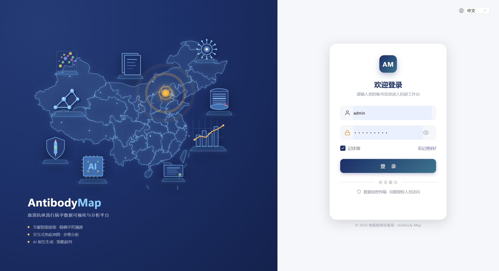
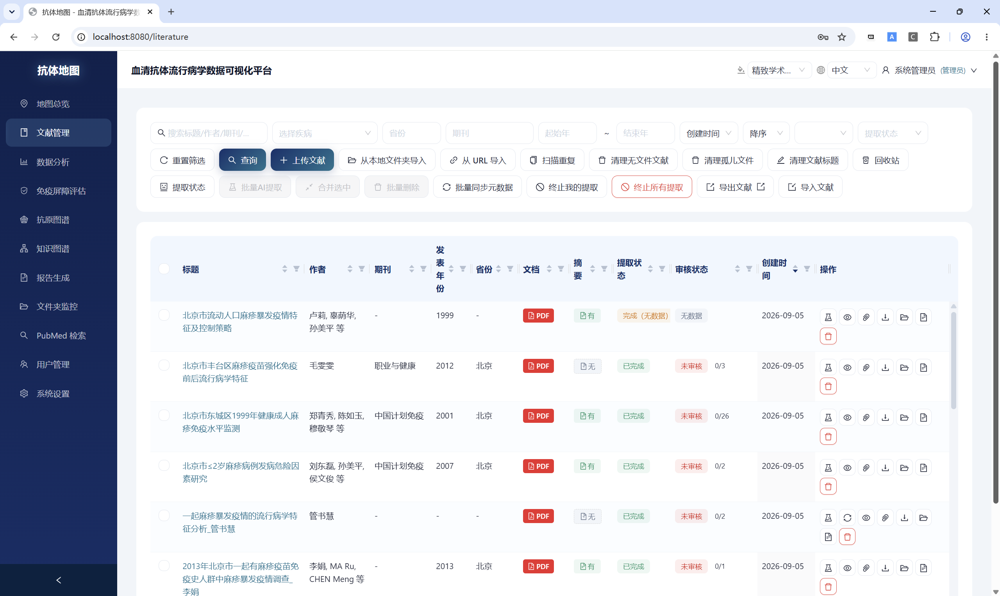
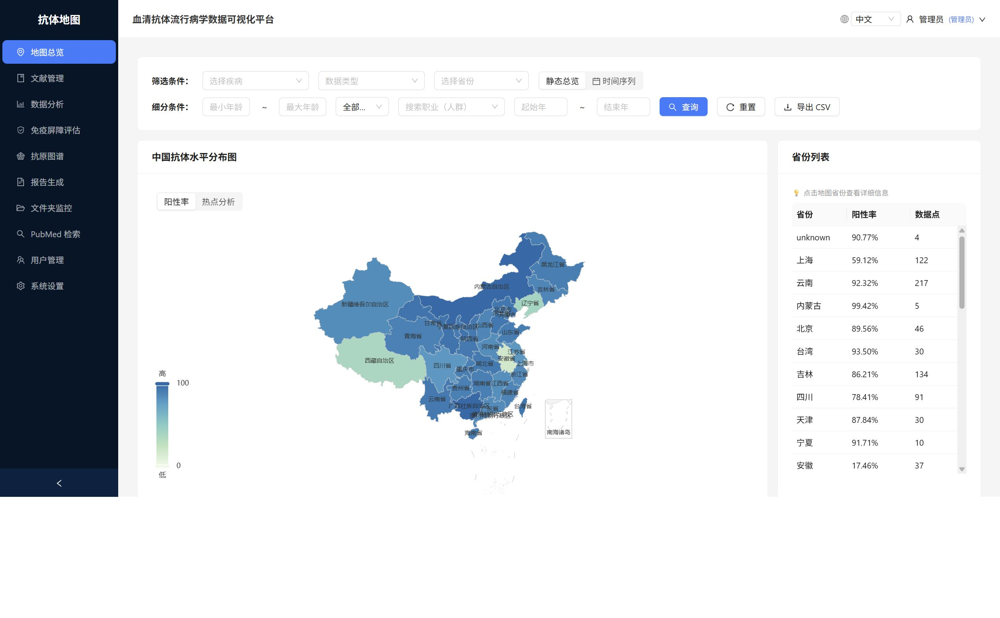
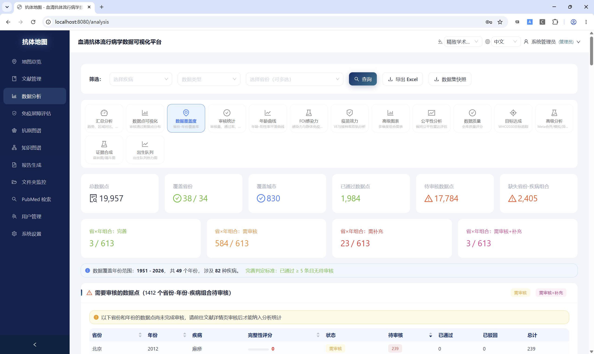

# 核心功能

本文档以**入门教程**的方式介绍 Antibody Map 的核心功能，配合截图让您快速上手。

---

## 1. 登录与首页

[](../screenshots/login.png)

1. 打开浏览器访问 `http://localhost:3000`
2. 输入账号和密码（默认管理员账号 `admin`，密码 `myk123456`）
3. 点击「登录」进入科研工作台

成功登录后进入**数据分析**首页，包含：
- 上方的筛选条件区（疾病、地区、年龄段、年份等）
- 下方的趋势图、区域对比、年龄分层等图表
- 点击「查询」刷新数据，点击「重置」清空所有筛选条件

---

## 2. 文献管理

文献管理是系统的基础模块，所有数据提取和分析都依赖文献库。

[](../screenshots/literature.png)

### 2.1 导入文献

支持多种导入方式：

| 方式 | 操作步骤 |
|---|---|
| **上传文件** | 点击「上传文献」→ 选择 PDF/CAJ/EPUB/DOCX/PPTX/XLSX/TXT/HTML 文件 → 自动识别标题并入库 |
| **URL 导入** | 点击「URL 导入」→ 输入网页链接 → 抓取 HTML 内容创建文献 |
| **题录批量导入** | 点击「导入题录」→ 选择 RIS / EndNote / PubMed 文本 / WoS 格式文件 → 自动查重后导入 |
| **PubMed 检索** | 侧边栏「PubMed 检索」→ 输入关键词 → 勾选结果 → 一键纳入数据库 |
| **文件夹监控** | 在系统设置中配置监控文件夹 → 自动检测新文件并导入（详见 [2.6 文件夹监控](#26-文件夹监控)） |

### 2.2 文献列表操作

文献列表支持：
- **筛选**：按疾病、省份、文档格式、摘要有无、提取状态进行过滤
- **排序**：点击表头按标题、作者、创建时间等列排序
- **搜索**：关键词模糊搜索标题和作者
- **批量操作**：多选后批量提取、批量删除、批量导出
- **文档预览**：点击展开在线预览 PDF/DOCX 等格式

### 2.3 重复检测与合并

点击「扫描重复文献」按钮，系统自动按 DOI/标题/作者/PDF 哈希检测重复，检测结果以分组列表展示，可逐组合并或一键合并全部。

### 2.4 回收站

删除的文献移入回收站（软删除），30 天内可还原。点击「回收站」按钮查看已删除文献，支持还原、永久删除和清空回收站。

---

### 2.5 文件夹监控

文件夹监控功能可以实时监听某个文件夹，当有新文件放入时自动导入到系统中，省去手动上传的麻烦。

#### 扫描间隔是什么？

**扫描间隔**就是系统每隔多少秒去看一次这个文件夹，检查有没有新增的文件。

可以类比成"保安巡逻"：
- 你告诉保安（系统）每隔 X 秒去仓库（监控文件夹）看一眼
- 如果发现新货（新文件），就搬进库房（自动导入到系统）
- 扫描间隔越短，发现新文件越及时，但系统会更频繁地检查文件夹

**默认值**：60 秒（即每分钟检查一次）

**设置建议**：
- 如果你希望文件放进去后尽快导入，可以设小一点（如 10 秒）
- 如果文件不多、不着急，保持默认 60 秒即可，没必要设得太短（浪费系统资源）

#### 如何添加监控文件夹

1. 进入**系统设置** → **文件夹监控设置**
2. 点击「添加文件夹」
3. 填写以下信息：
   - **文件夹路径**：容器内的路径（见下方注意事项）
   - **扫描间隔**：秒为单位（默认 60）
   - **文件类型**：可选的扩展名过滤，留空则监控所有支持的文件类型
4. 点击「保存」，系统会自动开始监控

#### 重要注意事项（必看）

**1. 路径问题：容器内 vs 宿主机**

这是最容易踩坑的地方！系统运行在 Docker 容器内，容器内的文件系统和宿主机（Windows 电脑）是隔离的。

- 你的文件夹在 Windows 上：`E:\文献\测试`
- 但在容器内部，这个路径**不存在**
- 必须先在 `docker-compose.yml` 中把这个文件夹**挂载**到容器内，才能让容器访问到它

**正确的配置步骤：**

**第一步：挂载目录到容器**

编辑项目根目录下的 [docker-compose.yml](file:///e:/01-liuxiong/trae/antibody_map/docker-compose.yml)，在 `backend` 和 `worker` 服务的 `volumes` 中新增一行：

```yaml
backend:
  volumes:
    - ./backend/data:/app/backend/data
    - ./backend/logs:/app/backend/logs
    - /mnt/e/01-liuxiong/antibody_map_ref/ref:/app/monitor/ref  # 新增：挂载监控目录
worker:
  volumes:
    - ./backend/data:/app/backend/data
    - ./backend/logs:/app/backend/logs
    - ./backend/data/mineru_cache:/root/.cache/modelscope
    - /mnt/e/01-liuxiong/antibody_map_ref/ref:/app/monitor/ref  # 新增：挂载监控目录
```

> 注意：WSL2 环境下，Windows 的 `E:\...` 路径要写成 `/mnt/e/...`（Linux 风格），否则 Docker 会报错 `invalid volume specification`。

**第二步：重启服务**

```bash
wsl docker compose up -d
```

**第三步：添加监控文件夹时填写容器内路径**

在系统设置中添加监控文件夹时，路径填写：
```
/app/monitor/ref
```

不要填 Windows 的 `E:\...` 路径，因为容器内部不认识 Windows 盘符。

**2. 文件类型过滤**

- 留空 = 监控所有支持的文件类型（PDF、DOCX、XLSX、PPTX、EPUB、TXT、HTML 等）
- 只监控特定类型：填写逗号分隔的扩展名，如 `.pdf,.docx`

**3. 文件去重**

系统会自动检测文件是否已导入，同名文件不会重复导入。但建议不要故意往监控文件夹里放同名文件，以免不必要的重复检查。

**4. 修改后需要重启**

- 修改 `docker-compose.yml` 后必须执行 `wsl docker compose up -d` 重启容器
- 修改监控文件夹配置（路径、间隔等）在系统设置中保存后立即生效，**不需要**重启

---

## 3. AI 数据提取

系统通过 LLM 自动从文献中提取血清阳性率、GMC 等数据点。

### 3.1 提取工作流程

一次 AI 提取由后台 Celery 任务驱动，完整链路如下：

1. **触发与入队**：勾选文献点击「AI 提取」后任务入队，状态 `queued`；实际开始提取时变为 `processing`。
2. **获取输入**：有关联文件则下载全文（本地路径 → MinIO 多层查找）；无文件但有摘要则直接用摘要作为提取输入。
3. **解析文本与表格**：`extract_text()` 按扩展名解析（AnyDoc 优先，失败自动回退 OCR/MinerU 等现有解析器）；PDF/CAJ 额外提取结构化表格并转成 Markdown 注入提示词，表格按文件哈希做内存缓存，避免同一文件重复解析。
4. **文本预处理**：清洗原文生成 `clean_text`（用于后续字符级溯源），并落盘一份供审核查看。
5. **LLM 提取 + 缓存**：先按「文献 + 模型 + 趟数 + 阈值 + 文本指纹」构建 key 查 Redis 缓存，命中则跳过调用直接重建数据点；未命中则注入最近被驳回的数据点作为 few-shot 示例，分块、多趟并发调用 LLM，同时记录耗时、token 与费用指标。
6. **校验与置信度**：每个提取结果经字符级溯源（失败时用 LLM 重抽原文片段）、强 Schema/省份枚举/值域校验，再按问题数量自动降级置信度（越低越靠前进入人工审核）。
7. **落地与收尾**：清除旧数据点 → 子估计归并到主估计 → 聚合补全文献元信息（作者/期刊/年份/省份）→ 记录 token 用量 → 状态置 `done`（有数据）或 `done_no_data`（空结果）→ 写入提取历史 → 成功后写入缓存。

> 该链路的可观测点：状态实时流转、提取历史、码位级原文溯源、置信度分级、提取缓存命中提示（历史中模型名带 `(cached)` 后缀）。

### 3.2 提取并发与排队机制

理解并发模型有助于合理安排批量提取任务，避免因并发饱和导致频繁排队。

#### 并发层级

AI 提取在两层维度上实现并发：

| 层级 | 并发能力 | 配置项 | 说明 |
|------|----------|--------|------|
| **文献级** | 同时 2 篇 | `--concurrency=2`（Celery worker） | Celery worker 使用 prefork 池，最多 2 个进程同时处理不同文献 |
| **分块级** | 单篇内 2 个并发 | `LLM_CONCURRENCY=2` 与 `OLLAMA_NUM_PARALLEL=2` | 一篇文献的长文本被切分为多个分块，同一篇文献内的分块可并发调用 LLM |

**文献级并发**：Celery worker 配置为 `--concurrency=2`，意味着最多同时处理 2 篇文献。如果提交了 5 篇，其中 2 篇立即进入 `processing`，其余 3 篇在 Redis 队列中等待，状态为 `queued`。当任意一篇完成后，排队中的下一篇自动开始。

**分块级并发**：单篇文献的文本超过 10,000 字符时会被切分为多个分块（每块最多 15,000 字符，重叠 500 字符）。这些分块使用 `asyncio.Semaphore(LLM_CONCURRENCY)` 并发调 LLM，提升单篇处理速度。该并发受 LLM 服务端（如 Ollama 的 `OLLAMA_NUM_PARALLEL`）限制，需保持一致。

#### 状态流转与排队规则

```
用户提交提取 → 数据库状态 queued → Celery 入队
                                  ↓
               Celery worker 空闲 → 出队 → 数据库状态 processing
                                  ↓
                    提取完成 → done / done_no_data
                                  ↓
                    提取失败 → failed（可重新提交）
```

- **`queued`（排队中）**：任务已提交，等待 Celery worker 空闲。此状态的任务在 Redis 队列中排队，worker 按 FIFO 顺序消费。
- **`processing`（提取中）**：worker 已开始处理该文献，实际执行 PDF 解析 → LLM 提取 → 数据入库的完整链路。
- **`done` / `done_no_data`（完成）**：提取成功，分别表示有数据点 / 无数据点。
- **`failed`（失败）**：提取过程发生异常，可在修复问题后重新提交。
- **`queued` 和 `processing` 状态的文献不会重复提交**，系统会跳过并返回提醒。

#### 同时处理数量上限

- 最多 **2 篇**文献同时处于 `processing` 状态
- 排队队列无硬性上限，但 redis 内存有限，建议单次提交不超过 50 篇
- 单篇文献内部的分块并发数受 LLM 服务端并发限制（Ollama 默认 2，远程 API 通常无限制）

#### 实际场景示例

| 提交篇数 | 立即 `processing` | 立即 `queued` | 说明 |
|----------|-------------------|---------------|------|
| 1 篇 | 1 篇 | 0 篇 | 直接开始处理 |
| 2 篇 | 2 篇 | 0 篇 | 并发饱和 |
| 5 篇 | 2 篇 | 3 篇 | 3 篇排队等待，完成后依次自动开始 |
| 10 篇 | 2 篇 | 8 篇 | 8 篇排队，先到先处理 |

#### 终止与重置

当服务器重启或任务异常中断时，数据库中的 `processing`/`queued` 状态可能残留。点击文献管理工具栏的 **「终止所有提取」** 按钮可：

1. 强制终止 worker 中正在运行的 Celery 任务
2. 清空 Redis 队列中所有等待的提取任务
3. 将数据库中所有 `processing`/`queued` 状态的文献重置为 `failed`

### 3.3 配置模型

在「系统设置」→「模型配置」中添加：
- **远程模型**：DeepSeek / OpenAI / Qwen 等 — 需填写 API Key 和 Base URL
- **本地模型**：Ollama 部署的模型（如 qwen2.5:14b）— 需填写模型名称

### 3.4 执行提取

1. 在文献列表中勾选需要提取的文献
2. 点击「AI 提取」→ 选择模型 → 确认
3. 系统自动提交任务，状态列显示 `queued`（排队中）→ `processing`（提取中）→ `done`（完成）或 `failed`（失败）
4. 点击「提取状态」按钮查看实时队列状态

### 3.5 查看提取结果

提取完成后，点击文献展开详情，可查看：
- 提取出的数据点列表（血清阳性率、GMC、样本量等）
- 每个数据点的**原文溯源**：精确标记了原文中的字符起始位置
- 置信度评分：基于多项信号自动打分

### 3.6 数据审核

数据审核工作流确保数据质量：
1. 每个数据点可**通过**或**驳回**
2. 驳回时填写审核意见，批量驳回强制填写
3. 审核人和审核时间自动记录
4. 支持**行内编辑**：直接修改疾病、地区、年龄段、数值等字段
5. 也可手动新增数据点

---

## 4. 地图可视化

[](../screenshots/map.png)

全国/省级/市级抗体水平热力地图，直观展示血清流行病学分布。

### 4.1 使用步骤

1. 在侧边栏选择「地图可视化」
2. 选择疾病类型（如麻疹、风疹、百日咳等）
3. 选择年份范围
4. 勾选「仅显示已审核数据」获得更可靠的结果

### 4.2 交互操作

- **点击省份**：钻取到该省份的市级数据
- **时间滑块**：拖动查看不同年份的变化动画
- **图例说明**：颜色深浅表示阳性率高低
- 底部统计区分已审核（绿色）与未审核（橙色）数据

---

## 5. 数据分析

[](../screenshots/analysis.png)

数据分析模块提供丰富的统计工具，满足血清流行病学研究需求。

### 5.1 基础分析

| 分析类型 | 说明 |
|---|---|
| **逐年趋势** | 阳性率随时间变化曲线 |
| **区域对比** | 按省份/地区分组对比 |
| **年龄分层** | 不同年龄段的抗体水平分布 |
| **数据覆盖度** | 评估数据的地理和时间覆盖范围 |

### 5.2 高级分析

| 分析类型 | 说明 |
|---|---|
| **FOI 感染力分析** | 催化模型 + R0 估算 + 群体免疫阈值 HIT |
| **疫苗效果 VE 分析** | 已接种/未接种亚组拆分 + 保护率估算 |
| **接种率双轨分析** | NIP 参考表 + 血清阳性率反推隐含接种率 |
| **省间公平性分析** | 基尼系数/变异系数/达标省 |
| **空间热点分析** | Moran's I + Getis-Ord Gi* 局部热点 |
| **Meta 分析** | 森林图/漏斗图/亚组分析 |
| **出生队列分析** | 代际免疫/计划免疫史解读 |
| **年龄-抗体曲线** | 惩罚样条平滑 + 年龄别 FOI |

### 5.3 操作步骤

1. 选择疾病和地区
2. 设置年龄范围和年份范围
3. 选择分析类型
4. 点击「查询」生成图表
5. 点击「导出 CSV」保存数据

---

## 6. 报告生成

系统支持 LLM 自动生成两种报告：

### 6.1 抗体分析报告

- 针对特定疾病和地区的抗体水平综合分析
- 包含趋势分析、区域对比、免疫屏障评估
- 支持在线编辑和下载

### 6.2 疫苗接种策略报告

- 基于血清学数据的疫苗接种策略研判
- 包含 FOI 估算、R0 分析、HIT 阈值
- 支持选择模型（本地 + 远程 API）

### 操作步骤

1. 在侧边栏选择「报告」
2. 选择报告类型（抗体分析 / 疫苗接种策略）
3. 设置疾病、地区、年份等参数
4. 选择 LLM 模型（可选，默认使用系统模型）
5. 点击「生成」→ 等待 LLM 完成 → 在线查看和编辑

---

## 7. 系统设置

在侧边栏底部进入「系统设置」。系统设置菜单对**所有登录用户可见**，其中「远程/本地模型配置」的创建、更新、删除及「数据备份与还原」中的**还原**为高危操作，仅管理员可用，普通用户可查看但按钮禁用。

- **远程模型配置**：管理 API Key 和 Base URL（仅管理员）
- **本地模型配置**：增删改查本地 Ollama 模型
- **后台日志**：loguru 按日落盘，支持文件切换、级别筛选、关键字搜索
- **系统信息**：版本号、运行环境、功能特性动态展示

### 7.1 数据备份与还原

数据备份与还原位于「系统设置」→「数据备份与还原」。用于**跨设备数据迁移**：把一台电脑上的数据带走，在新电脑（新客户端）上还原，实现文献库等数据的完整迁移。

#### 备份

- 系统对 PostgreSQL 执行 `pg_dump` 逻辑备份，备份文件为带时间戳的 `.sql` 文件，保存于 `backend/backups/` 目录。
- 点击「立即备份」可手动生成一份备份。
- **退出登录时系统会自动备份一次**（弹窗展示备份文件名），无需手动操作。
- 备份列表展示已有备份文件：名称、大小、生成时间，可点击「下载」把备份文件复制到 U 盘/其他电脑。

#### 还原（跨设备恢复，仅管理员）

把备份文件复制到新电脑后，用管理员账号登录，在「数据备份与还原」中：

1. 点击「上传备份文件并还原」，选择 `.sql` 备份文件；
2. 系统会**先自动备份当前库**（保险），随后清空并重建数据库，再在**单事务**内导入备份——若导入过程出错会自动回滚，数据库保持还原前状态，不会损坏；
3. 还原成功后，新电脑上的文献、数据点、用户、配置等即为备份时的状态。

> ⚠️ 还原为**高危操作**：会清空当前所有数据并用所选备份重建，操作前务必确认备份文件正确，且还原完成前不要进行其他操作。还原操作仅管理员可用。

#### 注意事项

- 备份/还原依赖容器内已安装的 `pg_dump` / `psql`（postgresql-client），无需额外配置。
- 还原很耗时，前端上传时已放大超时；大备份请耐心等待页面提示完成。
- 若之前设置的浏览器显示旧界面，请按 `Ctrl+F5` 强制刷新缓存，以确保看到最新的系统设置菜单与备份功能。

---

## 8. Edge 浏览器插件

参考 Mendeley 设计的浏览器插件，支持：
- 15+ 学术站点元数据自动识别
- PDF 智能抓取上传
- URL 网页导入
- 一键添加到数据库并触发 AI 提取
- 右键菜单和桌面通知

---

## 下一步

- 查看 [API 参考](api-reference.md) 了解 REST API 接口
- 查看 [配置参考](configuration.md) 了解系统配置项
- 查看 [部署指南](deployment.md) 了解生产环境部署